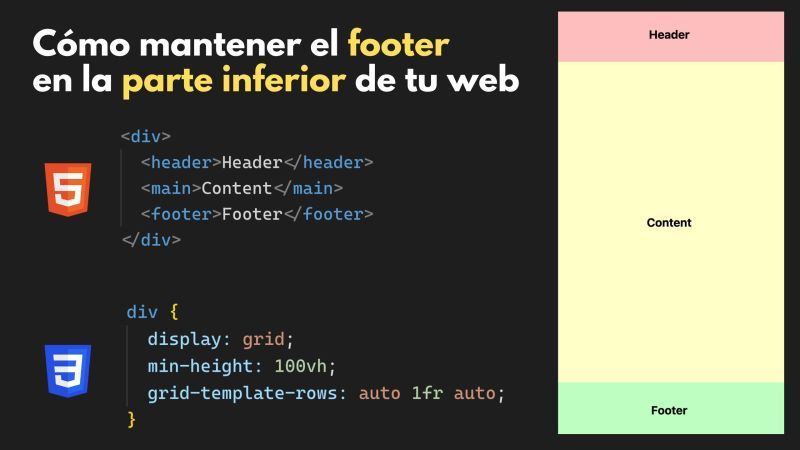

# Footer At The End with CSS Grid

* file.html
```html
<div>
  <header> HEADER </header>
  <main> MAIN </main>
  <footer> FOOTER </footer>
</div>
```

* style.css
```css
div {
  display: grid;
  min-height: 100vh;
  grid-template-rows: auto 1fr auto;
}
```

* Result:

