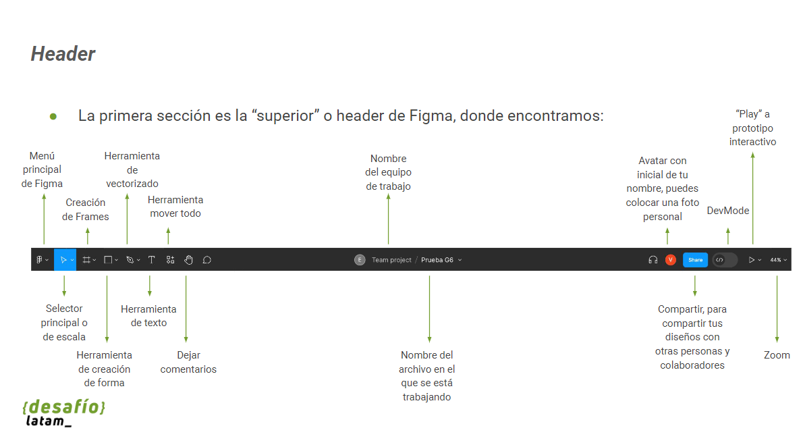

# Figma

Figma es una herramienta de diseño colaborativa en línea que ofrece varios beneficios, algunos de los cuales son:

- Colaboración en tiempo real
- Compatibilidad multiplataforma
- Comentarios y revisiones
- Control de versiones
- Integraciones

Figma es una popular herramienta de diseño y colaboración en línea que se utiliza comúnmente para la creación de interfaces de usuario, diseño de sitios web, aplicaciones móviles y más. Aquí tienes algunas consideraciones clave para trabajar de manera efectiva con Figma:

1. Comprender la interfaz de usuario de Figma:

   - Familiarízate con la interfaz de Figma, que incluye paneles como las capas, páginas y propiedades de objetos. Esto te ayudará a moverte con facilidad por la herramienta.

2. Organiza tus archivos:

   - Utiliza carpetas y una estructura de organización lógica para tus proyectos en Figma. Esto facilitará la búsqueda y colaboración en tus diseños.

3. Uso de componentes:

   - Los componentes son elementos reutilizables en Figma que pueden ahorrar mucho tiempo en el diseño y garantizar la consistencia. Aprende a crear y utilizar componentes para mantener una interfaz coherente.

4. Colaboración:

   - Figma se destaca por su capacidad de colaboración en tiempo real. Invita a tus compañeros de equipo a tus proyectos y utiliza las funciones de comentarios y notificaciones para mantener una comunicación efectiva.

5. Control de versiones:

   - Figma guarda automáticamente un historial de versiones de tus diseños. Aprende a usar esta función para rastrear cambios, volver a versiones anteriores y colaborar de manera más segura.

6. Uso de atajos de teclado:

   - Figma tiene una amplia gama de atajos de teclado que pueden aumentar significativamente tu productividad. Dedica tiempo a aprender y utilizar estos atajos.

7. Prototipado:

   - Figma permite crear prototipos interactivos. Aprende a utilizar esta función para simular la experiencia del usuario y probar la navegación de tu diseño.

8. Integraciones:

   - Figma se integra con muchas otras herramientas de diseño y desarrollo, como Zeplin, InVision, y desarrolladores de código. Aprovecha estas integraciones para mejorar la eficiencia de tu flujo de trabajo.

9. Importación y exportación:

   - Aprende cómo importar y exportar archivos en diferentes formatos, como Sketch, Adobe XD o archivos de imagen. Esto es útil para trabajar con diseñadores que utilizan otras herramientas.

10. Seguridad y permisos:

    - Si estás trabajando en un entorno empresarial o compartes archivos confidenciales, asegúrate de establecer adecuadamente los permisos y configuraciones de seguridad para proteger tus diseños.

11. Formación y recursos:

    - Figma ofrece una variedad de recursos de formación, tutoriales y documentación. Aprovecha estos recursos para mejorar tus habilidades en Figma.

12. Actualizaciones y novedades:

    - Mantente al tanto de las actualizaciones y nuevas características de Figma. La plataforma sigue evolucionando, por lo que es importante estar al tanto de las novedades para aprovechar al máximo sus capacidades.

Trabajar con Figma puede ser una experiencia muy productiva, especialmente cuando se utilizan estas consideraciones para optimizar tu flujo de trabajo y colaboración.

