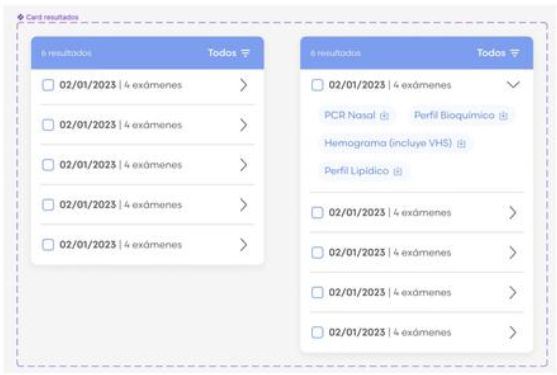
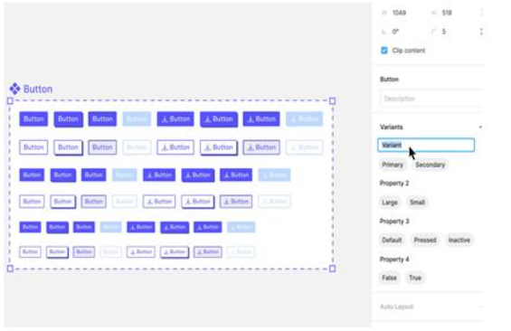
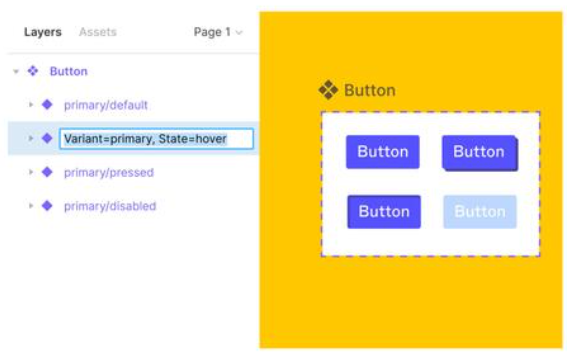
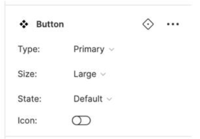

## Creación de Componente Máster con Variantes y Aplicación en Diseño en Figma

- Diseñar en base a componentes es una metodología de diseño que se centra en la creación de componentes máster y uso de instancias de diseño reutilizables y escalables.
- Esto permite diseñar el elemento sólo una vez y utilizar sus copias idénticas cuantas veces lo necesitemos.

### Componentes

- Los componentes son una grupación de una o varias capas o elementos de la interfaz que pueden ser reutilizados en diseños posteriores.
  
1. Componente Principal: también conocido como componente maestro, es aquel que define las propiedades y restricciones del componente.

  - En Figma, un componente maestro es el componente original que define las propiedades y restricciones de un elemento de la interfaz, como un botón o un menú desplegable.
  - Un cambio en el máster se refleja en todas las instancias de éste.

2. Instancia: es una copia del componente principal que se utiliza en un diseño específico. Las instancias heredan las propiedades y restricciones del componente principal, pero también pueden tener sus propias propiedades y restricciones únicas.

  - Las instancias son copias de un componente máster que se utilizan en un diseño específico.
  - Heredan las propiedaes y restricciones del componente máster, pero también pueden tener propiedades y restricciones únicas.
  - Estos cambios no afectan al resto de las instancias.

3. Variantes: son una característica que permite crear varias versiones de un mismo componente máster, cada una con propiedaes y estilos diferentes.

  - Las variantes son especialmente útiles para crear componentes como botones o menús desplegables que tienen diferentes estados u opciones.

4. Propiedaes: se refieren a los atributos y características de diseño que aplicamos a los componentes.

   
   - Pueden ser colores, las fuentes, las dimensiones, posición de elementos, con ícono, estilos de borde y relleno, entre otros.
   - Estas propiedades se pueden ajustar y personalizar para crear diseños únicos y coherentes.
