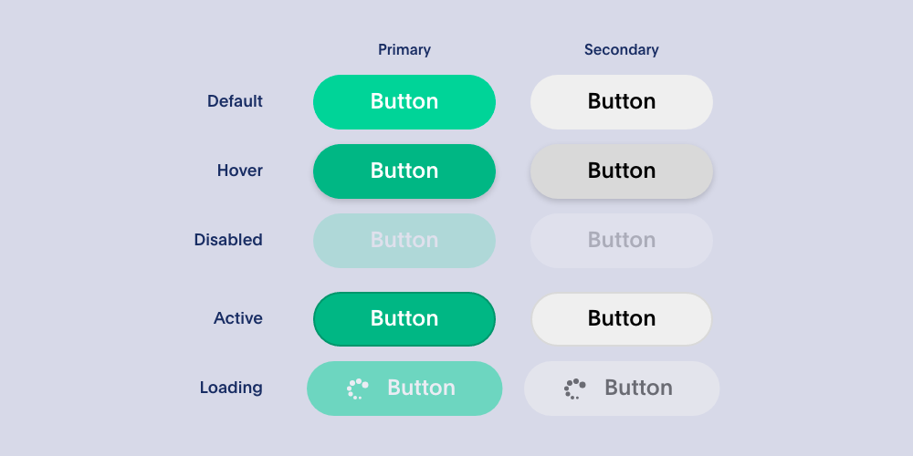
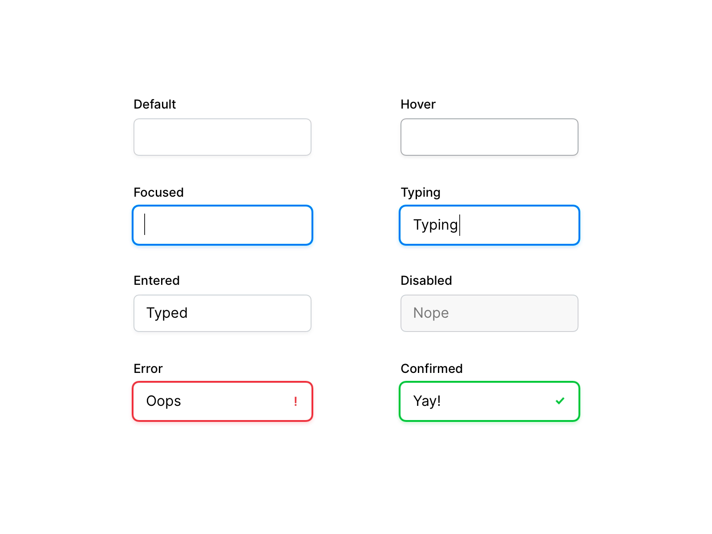
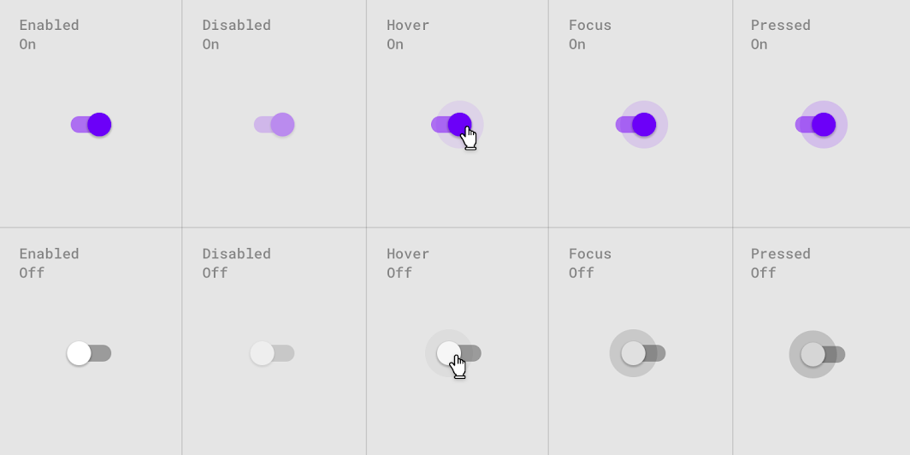

## Interacciones De Componentes y Microinteracciones

¿Qué son las interacciones?
Las interacciones en diseño UI se refieren a las formas en que los usuarios interactúan con un producto digital, como una aplicación o un sitio web. 
Estas interacciones pueden incluir gestos táctiles, clics de mouse, desplazamiento de la pantalla, movimientos del cursor, entradas de teclado y más. 
Micro interacciones
Las microinteracciones son pequeñas animaciones o respuestas que ocurren en una interfaz de usuario cuando este interactúa con ella. 

Estas microinteracciones son una parte importante del diseño de la experiencia de usuario y pueden mejorar en gran medida la usabilidad y el atractivo visual de una aplicación o sitio web.

### Estados de componentes

Para crear microinteracciones es relevante conocer el estado de nuestros componentes, que han sido estandarizados con el tiempo. 

Los estados pueden tener el look definido por nosotros, pero siempre es relevante considerar estas variantes para hacer un producto digital más interactivo.

- Botones

  

- Inputs

  

- Toggle

  
