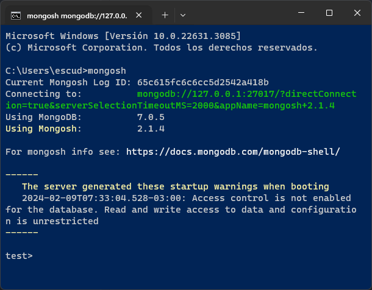

# Installation

- Download and install MongoDB setup from (MongoDB)[https://www.mongodb.com/try/download/community]
- Download and install MongoDB Shell setup from (MongoDB)[https://www.mongodb.com/try/download/shell]
- Verify correct installation: in the terminal run
  ```powershell
  mongosh
  ``` 
- You should see the installed version
  
  