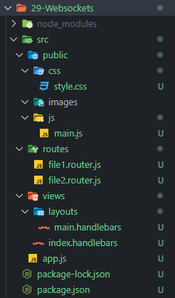

# Get Started

- Init Project
  ```powershell
  npm init -y
  npm install express // express
  npm install express-handlebars // handlebars
  npm install socket.io // websocket
  ```
- Create Project Folder Structure Example:
  
  

- 