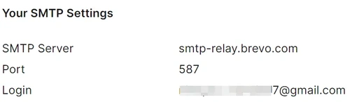
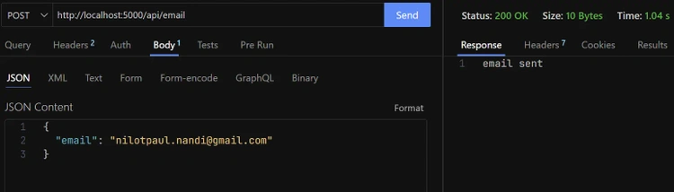
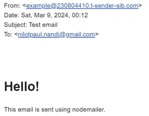
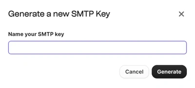

# How to send emails with node.js
Learn how to send emails with node.js using nodemailer library and via email API service. Explanation with code examples and best practices.

Published: Aug 06, 2024


## How to send emails with node.js

- How to send emails using node.js?
- What is Nodemailer?
- Advantages of using Nodemailer?
- What is an email API service?
- Advantages of using an email API service?
- How to send email using Nodemailer and SMTP
- How to send email using an email API service

## Conclusion
These days, every web application needs a reliable method for sending emails. Whether it's for user authentication, account notifications, or communicating with customers, email functionality is essential for modern web development.

In this guide, we'll learn to send emails from a Node.js application. By the end, you'll have the knowledge and tools you need to ensure seamless email communication in your web projects.

## How to send emails using node.js?
There are two easy options to send email which are:

- Nodemailer
- Email api service like Brevo

## But which is better?

<div class="relative w-full overflow-auto" bis_skin_checked="1"><table class="w-full caption-bottom text-sm"><thead class="[&amp;_tr]:border-b"><tr class="border-b transition-colors hover:bg-muted/50 data-[state=selected]:bg-muted"><th class="h-12 px-4 text-left align-middle [&amp;:has([role=checkbox])]:pr-0 font-bold text-black dark:text-white"></th><th class="h-12 px-4 text-left align-middle [&amp;:has([role=checkbox])]:pr-0 font-bold text-black dark:text-white">Nodemailer</th><th class="h-12 px-4 align-middle [&amp;:has([role=checkbox])]:pr-0 font-bold text-black dark:text-white text-right">Email api service</th></tr></thead><tbody class="[&amp;_tr:last-child]:border-0"><tr class="border-b transition-colors hover:bg-muted/50 data-[state=selected]:bg-muted"><td class="p-4 align-middle [&amp;:has([role=checkbox])]:pr-0 font-semibold">Cost</td><td class="p-4 align-middle [&amp;:has([role=checkbox])]:pr-0">Yes</td><td class="p-4 align-middle [&amp;:has([role=checkbox])]:pr-0">No</td></tr><tr class="border-b transition-colors hover:bg-muted/50 data-[state=selected]:bg-muted"><td class="p-4 align-middle [&amp;:has([role=checkbox])]:pr-0 font-semibold">Email server required</td><td class="p-4 align-middle [&amp;:has([role=checkbox])]:pr-0">Pay for server, logging &amp; maintenance</td><td class="p-4 align-middle [&amp;:has([role=checkbox])]:pr-0">Subscription based</td></tr><tr class="border-b transition-colors hover:bg-muted/50 data-[state=selected]:bg-muted"><td class="p-4 align-middle [&amp;:has([role=checkbox])]:pr-0 font-semibold">Managing Expertise</td><td class="p-4 align-middle [&amp;:has([role=checkbox])]:pr-0">High</td><td class="p-4 align-middle [&amp;:has([role=checkbox])]:pr-0">Low</td></tr><tr class="border-b transition-colors hover:bg-muted/50 data-[state=selected]:bg-muted"><td class="p-4 align-middle [&amp;:has([role=checkbox])]:pr-0 font-semibold">Scalability</td><td class="p-4 align-middle [&amp;:has([role=checkbox])]:pr-0">Hard</td><td class="p-4 align-middle [&amp;:has([role=checkbox])]:pr-0">Easy</td></tr></tbody></table></div>


## What is Nodemailer?
Nodemailer is the most popular Node.js library for sending emails. It makes working with emails very easy using various email providers and services. It abstracts the logic of using an email protocol like SMTP(Simple Mail Transfer Protocol) and provides an efficient way for sending emails.

## Advantages of using Nodemailer?
- Versatility: It supports various email transport methods, including SMTP, sendmail, Amazon SES, and more, providing developers with flexibility in choosing the most suitable option for their use case.
- Reliability: Nodemailer follows best practices for email security, including support for SSL/TLS encryption and authentication mechanisms.
- Security: It follows best practices for email security, including support for SSL/TLS encryption and authentication mechanisms.

## What is an email API service?
These services provide dedicated APIs and infrastructure for sending and managing emails, eliminating the need to set up and maintain your own email servers. And, you pay based on usage, rather than fixed hardware costs.

## Advantages of using an email API service?
- Cost: Email API services often offer flexible pricing plans that allow you to pay only for the emails you send, making them a cost-effective solution for businesses of all sizes.
- Features: Many email API services offer advanced features for personalizing and segmenting email content, tracking delivery metrics, managing subscriber lists, and handling bouncebacks and spam complaints.
- Customer Support: Most email API services provide dedicated customer support to help you troubleshoot issues, optimize, etc.

---
# How to send email using Nodemailer and SMTP
***'Nodemailer'*** is the most popular choice for sending emails from a node app. This library has built-in smtp support
and you can customise your emails using html, plain text, etc.

## Let's get started!

- Install Packages: Run the following command to install necessary packages.
```bash
npm install express dotenv nodemailer
```
- Create a Transporter: Setup an email transporter using the email service of your choice. In this case we'll be using Brevo.
- Go to Brevo -> SMTP & API, get the login and generate a new smtp key and put those in a .env file.



## Brevo SMTP & API Key
email.js
```js
const nodemailer = require('nodemailer');
 
const transporter = nodemailer.createTransport({
  host: 'smtp-relay.brevo.com',
  port: 587,
  secure: false, // true for port 465
  auth: {
    user: process.env.BREVO_USER,
    pass: process.env.BREVO_SMTP_KEY,
  },
});
```
- Send Email helper: Create a sendEmail function that'll send an email to the provided email address. It's a good practice to keep your services seperate from other logic.
email.js
```js
const sendEmail = async ({ email, subject, message }) => {
  const htmlContent = `
  <html>
    <body>
      <h1>Hello!</h1>
      <p>${message}</p>
    </body>
  </html>
`;
 
  const info = await transporter.sendMail({
    from: process.env.ADMIN_EMAIL,
    to: email,
    subject,
    html: htmlContent,
  });
 
  if (info.rejected.length !== 0) {
    return { success: false };
  }
 
  return { success: true };
};
 
module.exports = {
  sendEmail,
};
```

In the above code, we used our email transporter which takes parameter like from, to, subject and html. After which we called the sendMail method from our transporter passing these values.

- Make a server.js file: Putting all the pieces together.
server.js
```js
const express = require('express');
const dotenv = require('dotenv');
const { sendEmail } = require('./lib/email');
 
dotenv.config();
 
const PORT = Number(process.env.PORT) || 5000;
const app = express();
 
// middlewares
app.use(express.json());
 
app.post('/api/email', async (req, res) => {
  const body = req.body;
  const email = body.email;
 
  if (!email) {
    return res.send('no email provided');
  }
 
  try {
    const { success } = await sendEmail({
      email,
      subject: 'Test email',
      message: 'This email is sent using nodemailer.',
    });
 
    if (!success) {
      return res.send('failed to send the email');
    }
 
    return res.send('email sent');
  } catch (error) {
    console.error(error);
    return res.json(error);
  }
});
 
app.listen(PORT, () => {
  console.log(`server running on port: ${PORT}`);
});
```

- Here, we first added the ***'app.use(express.json())'*** as middleware as we'll send json as the request body.
- Then, we made a /api/email route which will be responsible for sending emails.
- That's it, we're done. Now let's test our app.
- Test by sending emails: Now, let's send a post request to /api/email. If you're using vscode, use Thunder Client.
First, run the server by:
```bash
node server.js
```



- As you can see everything works correctly. And we should recieve the following email:



---
# How to send email using an email API service
With this second option, we don't need a SMTP server so, this will be easier to setup and manage. For this example we'll be using Brevo.

## First create an account.
Brevo's free plan allows users to send upto 300 emails per day which is plenty for starting out.

Go to brevo dashboard, from the dropdown at right select SMTP & API. There you'll see your smtp settings, now generate a new smtp key.



After that copy the smtp key and put that in a .env file.

## Install Packages: Run the following command to install necessary packages.
```bash
npm install express dotenv
```
## Send Email helper: Create a sendEmail function that'll send an email to the provided email address. It's a good practice to keep your services seperate from other logic.
```js
const sendEmailViaApi = async ({ to, subject, message }) => {
  const htmlContent = `
    <html>
      <body>
        <h1>Hello!</h1>
        <p>${message}</p>
      </body>
    </html>
  `;
 
  const headers = {
    'Content-Type': 'application/json',
    'api-key': process.env.BREVO_API_KEY,
  };
 
  const body = {
    sender: {
      name: 'Nilotpaul Nandi',
      email: process.env.ADMIN_EMAIL,
    },
    to: [
      {
        email: to,
      },
    ],
    subject,
    htmlContent,
  };
 
  const res = await fetch('https://api.brevo.com/v3/smtp/email', {
    headers,
    method: 'POST',
    body: JSON.stringify(body),
  });
 
  if (res.status !== 201) {
    return { success: false };
  }
 
  return { success: true };
};
 
module.exports = {
  sendEmailViaApi,
};
```
This function makes a POST request to a brevo api endpoint which takes the user's email and returns a success status.

## Make a server.js file: Wiring up everything.
```js
const express = require('express');
const dotenv = require('dotenv');
 
const { sendEmailViaApi } = require('./lib/email');
 
dotenv.config();
 
const PORT = Number(process.env.PORT) || 5000;
const app = express();
 
// middlewares
app.use(express.json());
 
app.post('/api/brevo', async (req, res) => {
  const body = req.body;
 
  const email = body.email;
 
  if (!email) {
    return res.send('no email provided');
  }
 
  try {
    const { success } = await sendEmailViaApi({
      to: email,
      subject: 'Test email',
      message: 'This email is sent using nodemailer.',
    });
 
    if (!success) {
      return res.status(500).send('failed to send the email');
    }
 
    return res.send('email sent');
  } catch (error) {
    console.error(error);
    return res.status(500).json(error);
  }
});
 
app.listen(PORT, () => {
  console.log(`server running on port: ${PORT}`);
});
```
## Test by sending emails: Send a post request to /api/brevo. If you're using vscode, use Thunder Client.
Start the server by:
```bash
node server.js
```
If your setup is correct, everything should work correctly. Furthermore you can monitor your limit via Brevo dashboard and upgrade your plan if necessary.

---
# Conclusion
In this guide, we've learned 2 methods for sending emails via a node.js application: using Nodemailer and SMTP, as well as an email API service (like Brevo). We've broken down their advantages, which we hope will help you choose the best option for yourself.


