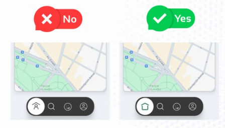
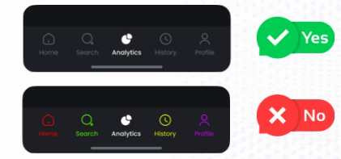

# Errores Comunes que debemos evitar

## Botones Primarios en Mobile

- En dispositivos móviles, asegurarse que los botones primarios tengan un arncho completo (full-width) dentro de los márgenes seguros (safe zone)
Esto además de mejorar la 'accesibilidad', mejora la 'usabilidad', facilitando que los usuarios interactúen con la app sin errores.

## Íconos Intuitivos

- Los íconos deben facilitar la comprensión de las acciones a realizar, no ser un rompecabezas. Asegurarse que los íconos sean intuitivos y se entiendan de manera rápida.

## Ignorar los Estados de Carga

- No dejes a los usuarios preguntándose si algo anda mal. Utiliza loaders o skeleton screen que reflejen la estructura de la pantalla que está cargando.

Esto mantiene la atención del usuario y mejora la percepción de velocidad de tu aplicación.

## Uso de Colores

- Los colores juegan un papel crucial en UI y pueden fácilmente confundir a los usuarios si no se usan correctamente.
Manten la consistencia y el minimalismo en tu paleta de colores para evitar distracciones y asegurar una navegación clara y agradable.
  -  _**Algo a tener en cuenta también es el contraste de colores para una correcta accesibilidad!**_

