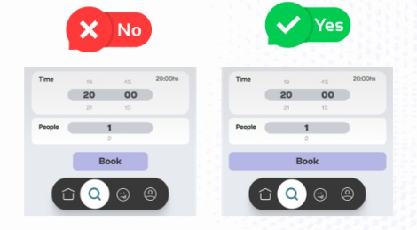

# Errores Comunes que debemos evitar

## Botones Primarios en Mobile

- En dispositivos móviles, asegurarse que los botones primarios tengan un arncho completo (full-width) dentro de los márgenes seguros (safe zone)
Esto además de mejorar la 'accesibilidad', mejora la 'usabilidad', facilitando que los usuarios interactúen con la app sin errores.

## Íconos Intuitivos

- Los íconos deben facilitar la comprensión de las acciones a realizar, no ser un rompecabezas. Asegurarse que los íconos sean intuitivos y se entiendan de manera rápida.

